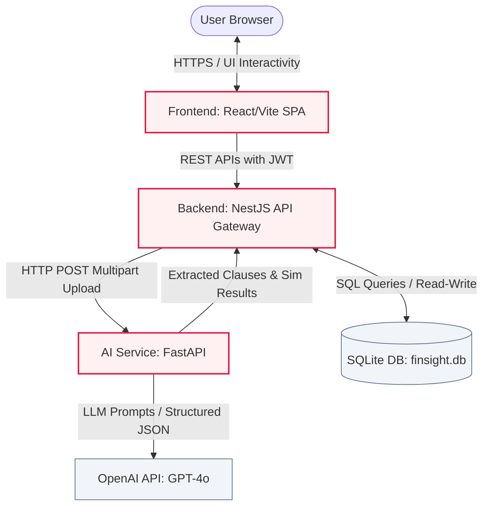

# 🌊 Bizpulse - Comprehensive System Documentation & Technical Blueprint

This document provides an in-depth, technical guide to **Bizpulse**, a premium financial intelligence platform designed for freelancers and small businesses. It features an automated invoice/expense tracker, dynamic cash flow analytics, and an AI-driven contract analyzer that extracts legal clauses, simulates loan repayment schedules, and generates risk decisions.

---

## 📖 1. Project Overview & Summary

### What It Does
**Bizpulse** is a dual-purpose financial management and legal intelligence application:
1. **Financial Management**: Users can create profiles, log corporate expenses, manage client directories, generate standard GST invoices, track overdue payments, and monitor their net financial standing via real-time cash flow analysis and KPI dashboards.
2. **AI-Powered Contract Analysis**: It analyzes uploaded loan agreements (PDF or DOCX), automatically parses the document text, extracts critical clauses (e.g., interest rates, tenure, penalty metrics), and feeds them into a mathematical simulation engine. This engine outputs monthly EMI projections, repayment totals, credit score impacts, and late-fee projections.
3. **Automated Risk Engine**: The system contrasts the simulated loan repayment obligation against the user's recorded monthly business income to calculate a Debt-to-Income (DTI) ratio. Using an LLM-based financial advisor agent, it generates a recommendation ("PROCEED", "CAUTION", or "DECLINE"), a risk warning summary, strategic alternatives, and a pre-drafted negotiation email to send to the lender.

### How It Does It
Bizpulse uses a decoupled three-tier microservice architecture:
- **Frontend**: A single-page application (SPA) built with React, Vite, and TypeScript. Styling is governed by Tailwind CSS and custom glassmorphism layers, providing a premium red/white theme. Data fetching, caching, and state synchronization are managed using `@tanstack/react-query`.
- **Backend (API Gateway & Core Logic)**: A NestJS framework utilizing TypeScript. It acts as the business logic gateway, exposing REST APIs, handling user authentication (via JWT), performing data operations with TypeORM, and persisting records into a local SQLite database (`finsight.db`). When contracts are uploaded, it acts as an orchestrator, forwarding the documents to the AI Service and persisting the results.
- **AI Service**: A lightweight FastAPI backend written in Python. It parses binary documents using `pdfplumber` or `python-docx`, processes the extracted text using LangChain and OpenAI's `gpt-4o` models to extract parameters and generate financial advice, and runs numerical math packages to simulate loan dynamics.

---

## ⚙️ 2. Local Hosting Guide

You can host Bizpulse locally in two ways: **Service-by-Service Execution** (recommended for active development) or **Docker Compose** (for single-command orchestration).

### Method A: Service-by-Service Execution (Separate Terminals)

Ensure you have [Node.js (v18+)](https://nodejs.org/), [Python (3.9+)](https://www.python.org/), and an active OpenAI API key.

#### Step 1: Clone & Configure Backend (NestJS)
In your terminal, navigate to the `backend` directory, install packages, set up environmental variables, and run:
```bash
# Navigate to backend
cd backend

# Install node dependencies
npm install

# Create environment configuration (verify values match)
# Copy example or create manual .env
# The backend will automatically generate 'finsight.db' on startup and seed data
npm run start:dev
```
* **Host Address**: `http://localhost:3001`
* **API Entrypoint**: `http://localhost:3001/api`

#### Step 2: Configure & Start Frontend (React + Vite)
In a new terminal window, navigate to the `frontend` directory, install packages, and start the development server:
```bash
# Navigate to frontend
cd frontend

# Install node dependencies
npm install

# Start Vite dev server
npm run dev
```
* **Access URL**: [http://localhost:5173](http://localhost:5173)
* *Note*: By default, Vite proxies requests to the backend API on `http://localhost:3001/api`.

#### Step 3: Configure & Launch AI Service (Python FastAPI)
In a third terminal window, navigate to the `ai-service` directory. You will create a virtual environment, activate it, install requirements, and boot the Uvicorn server:

**For Bash / Linux / macOS:**
```bash
# Navigate to ai-service
cd ai-service

# Create virtual environment
python -m venv venv

# Activate virtual environment
source venv/bin/activate

# Install requirements
pip install -r requirements.txt

# Run FastAPI app with Uvicorn
python -m uvicorn app.main:app --reload
```

**For Windows (PowerShell):**
```powershell
# Navigate to ai-service
cd ai-service

# Create virtual environment
python -m venv venv

# Activate virtual environment
.\venv\Scripts\Activate.ps1

# Install requirements
pip install -r requirements.txt

# Run FastAPI app with Uvicorn
python -m uvicorn app.main:app --reload
```
* **Swagger Documentation URL**: `http://localhost:8000/docs`
* **AI API Address**: `http://localhost:8000`
* *Configuration Note*: Ensure your `ai-service/.env` file contains your `OPENAI_API_KEY`.

---

### Method B: Single-Command Docker Orchestration
If you want to run the full stack including dedicated Postgres database and Redis cache containers:
```bash
# From the root directory (containing docker-compose.yml)
docker-compose up --build
```
This builds and connects:
1. `postgres` (port `5432` for production database operations)
2. `redis` (port `6379` for caching)
3. `backend` (port `3001` linked to postgres & redis)
4. `ai-service` (port `8000` linked to postgres)
5. `frontend` (port `5173` linked to the backend service)

---

## 📐 3. System Architecture & Workflow

### Architectural Overview Diagram



### Operational Workflow Steps

1. **Authentication Gate**: The user signs in on the React Frontend. The request is processed by `/backend/src/auth/auth.service.ts` which returns a Signed JWT token. All subsequent client-side REST requests append this token under the HTTP `Authorization: Bearer <token>` header.
2. **Dashboard & Accounting Feed**: The React frontend requests dashboard metrics. `/backend/src/analytics/analytics.service.ts` runs TypeORM query queries against the SQLite tables for invoices and expenses, computes profit margins and a dynamic Financial Health Score, and returns the payload.
3. **Contract Analysis Upload**:
   - The user drags a legal document into the React Dropzone (`/frontend/src/components/contracts/ContractsPage.tsx`).
   - The frontend forwards this file to `/backend/src/contracts/contracts.controller.ts` via endpoint `POST /api/contracts/analyze`.
   - The backend creates an initial database log with a status of `processing` and starts a raw HTTP multipart/form-data upload stream directed at the AI Service's endpoint `POST http://localhost:8000/analyze/contract`.
4. **AI Parsing & Extraction Engine**:
   - FastAPI receives the document bytes. `DocumentParser` checks extensions; if PDF, it uses `pdfplumber` to extract text; if DOCX, it utilizes `docx`; otherwise, it decodes raw UTF-8 characters.
   - The parser passes the first 8000 characters of text to `ClauseExtractor`. It leverages LangChain to prompt OpenAI's `gpt-4o` model, forcing it to output a structured JSON array representing extracted clauses, financial figures, plain English translations, and legal risk designations ("Low", "Medium", "High").
   - The service extracts loan parameters (amount, interest rate, tenure) from the LLM response.
5. **Simulations & Advisors**:
   - The extracted parameters are passed to `FinancialSimulator` to compute the amortization schedule, penalty values, credit score reductions, and minimum income thresholds.
   - The parameters, simulation dictionary, and the user's business profile are passed to `DecisionEngine`, which queries `gpt-4o` to generate the advisor's final assessment, a risk justification, alternative recommendations, and a client-lender negotiation letter.
6. **Data Storage & Client Update**: The FastAPI service returns this structured JSON back to NestJS. The NestJS backend database record updates the contract record status to `completed`, mapping the clauses, simulation, and recommendations into the table schema. The client UI receives the completed payload, updating the dropzone to display the rich analytical cards.

---

## 🛠️ 4. Technology Stack Analysis

| Technology | Why It Was Chosen | How It Is Used | What It Accomplishes |
| :--- | :--- | :--- | :--- |
| **React (v19)** | High performance component architecture, standard virtual DOM reconciliation. | Handles components, layouts, routing, forms, and drag-and-drop actions. | Renders a responsive, reactive user dashboard. |
| **Vite** | Blazing fast ESM-based hot module replacement (HMR) and optimized rollup production bundles. | Dev server and bundler. | Drastically speeds up frontend iteration cycles and outputs small asset sizes. |
| **NestJS (v11)** | Standardized architecture (Modules, Controllers, Providers) mimicking enterprise-grade backends. | Implements controllers, JWT security, custom middleware interceptors, and database pipelines. | Ensures cleanly separated, maintainable, and strongly-typed backend APIs. |
| **FastAPI** | High-performance ASGI Python framework built on Pydantic validation. | Exposes three specialized high-performance AI and financial endpoints. | Processes heavy files, validates payloads with Pydantic, and handles LLM connections asynchronously. |
| **Tailwind CSS** | Utility-first styling reducing custom CSS bloat. | Paired with custom fonts and variables to build the glassmorphism layout tokens. | Governs the premium rose/white glassmorphism layout theme with minimal CSS. |
| **SQLite (`better-sqlite3`)** | Zero-configuration file-based database. | Configured inside TypeORM modules to save users, clients, invoices, expenses, and contract outputs. | Provides developer-friendly local data persistence without running DB engines. |
| **LangChain (`langchain-openai`)** | Abstraction layer for structured model requests. | Constructs ChatPromptTemplates and parses raw LLM output into validated JSON blocks. | Interfaces reliably with GPT-4o, extracting structured data arrays out of unstructured legal files. |
| **TypeORM** | Type-safe Object-Relational Mapping (ORM). | Maps TypeScript classes directly into SQLite database schema and handles relations. | Handles database queries and schema updates cleanly without writing raw SQL. |
| **Framer Motion** | Declarative animation engine. | Handles state-driven components like dropdowns, page transitions, and card slide-ins. | Delivers smooth transitions, dropdown accordions, and active dashboard entries. |
| **Recharts** | Declarative React charting package. | Feeds cash flow, margin, and expense distributions into responsive SVG containers. | Renders interactive, styled line graphs and expense pie charts. |

---

## 📂 5. File & Folder Breakdown

### Root Directory

* **`/backend/`** — NestJS server (API Gateway and core database logic).
* **`/frontend/`** — React application (User facing dashboard).
* **`/ai-service/`** — FastAPI services (Legal parsing, LangChain extractor, loan simulator).
* **`/finsight-pro-complete/`** — A complete reference backup of the system including development environments.
* **`docker-compose.yml`** — Docker orchestration script outlining the Postgres, Redis, backend, frontend, and AI configurations.
* **`sample_contract.txt`** — A mock loan agreement containing structured numbers ($750K principal, 14.5% interest, 48 months tenure, 4% late penalty) used for system testing.
* **`BIZPULSE_GUIDE.md`** — Introductory setup document containing credentials and local hosting guidelines.
* **`README.md`** — Application configuration placeholder.

---

### Backend Directory (`/backend`)

#### Core System Configuration
* **`package.json`** — Defins packages like `@nestjs/typeorm`, `better-sqlite3`, `passport-jwt`, `bcryptjs`, and configurations.
* **`tsconfig.json`** / **`tsconfig.build.json`** — Custom configurations for the TypeScript compiler.
* **`nest-cli.json`** — Controls build paths, source roots, and Nest compilation commands.
* **`eslint.config.mjs`** / **`.prettierrc`** — Styles, guidelines, and linting rules.
* **`src/main.ts`** — Application entry point. Configures global CORS, sets the API route prefix to `/api`, and starts the server on port `3001`.
* **`src/app.module.ts`** — Main system module. Configures the TypeORM database connection (pointing directly to the SQLite `finsight.db` file) and triggers the auto-seeding routine.

#### Shared Services & Guards (`/src/common`)
* **`src/common/guards/jwt-auth.guard.ts`** — Global NestJS guard that protects controller routes, validating request headers for a valid JWT.
* **`src/common/services/seed.service.ts`** — Automatic data seeder. Triggers `onModuleInit` to check if databases are populated; if not, it inserts default demo accounts (`admin@bizpulse.com`, `demo@bizpulse.com`), 10 clients, 24 invoices, and 20 expenses.

#### Feature Modules (`/src/*`)
* **`src/auth/`** (Module, Controller, Service, JWT Strategy) — Handles user login, sign up, bcrypt security checks, and issues signed JWT bearer tokens.
* **`src/users/`** (Module, Controller, Service, User Entity) — Handles user profiles, including monthly income figures and business profiles used in DTI calculations.
* **`src/clients/`** (Module, Controller, Service, Client Entity) — Manages corporate client details (billing addresses, emails, GST identification numbers).
* **`src/expenses/`** (Module, Controller, Service, Expense Entity) — Logs business expenses under categories like software, marketing, or travel.
* **`src/invoices/`** (Module, Controller, Service, Invoice & Item Entities) — Standard billing module. Handles invoice number generators, due dates, tax (GST) calculations, and line items.
* **`src/analytics/`** (Module, Controller, Service) — Pulls analytical records from SQLite. Calculates net income, monthly cash flows, expense category breakdowns, and top customer accounts.
* **`src/contracts/`** (Module, Controller, Service, Contract Entity) — Manages the contract analysis pipeline.
  * **`entities/contract-analysis.entity.ts`** — Table schema capturing contract metadata, analysis status, and JSON columns for legal clauses, simulations, and decision profiles.
  * **`contracts.service.ts`** — Handles database inserts. It reads uploaded files, constructs a standard HTTP multipart boundary stream, forwards it to the Python service, parses the return JSON, and saves the final data to SQLite.

---

### AI Service Directory (`/ai-service`)

#### Core Infrastructure
* **`requirements.txt`** — Package list (LangChain, OpenAI wrappers, FastAPI, Uvicorn, Pydantic, Docx, PDFPlumber).
* **`Dockerfile`** — Container definition for building the FastAPI server.
* **`setup.ps1`** / **`setup_new.ps1`** — PowerShell automation scripts for virtual environments and dependencies.
* **`app/main.py`** — Starts FastAPI, sets CORS headers, and includes router paths for `/analyze`, `/simulate`, and `/decide`.
* **`app/config.py`** — Uses Pydantic to read environment configurations (keys, model overrides).

#### API Endpoints & Routes (`/app/routers`)
* **`app/routers/contract_router.py`** — Main endpoint `POST /contract`. Receives binary uploads, calls the parser, extracts clauses, runs the financial simulation, evaluates the transaction risk, and returns the combined analysis payload.
* **`app/routers/simulator_router.py`** — Exposes `POST /loan` to let users run manual math-based loan projections.
* **`app/routers/decision_router.py`** — Exposes `POST /` to recalculate risk decisions when parameters change.

#### Data Schemas (`/app/models`)
* **`app/models/simulation_models.py`** — Pydantic structures for input data validation (principal, interest, months, missed counts) and output formatting (EMI, repayment, penalty, credit changes).

#### Specialized Core Services (`/app/services`)
* **`app/services/document_parser.py`** — Parses files by extension. Uses `pdfplumber` for PDFs and `python-docx` for Word documents.
* **`app/services/clause_extractor.py`** — Uses LangChain to prompt GPT-4o with the document text. Instructs the model to output a strict JSON array containing clause types, plain explanations, risk levels, and financial values.
* **`app/services/simulator.py`** — Runs financial formulas. Calculates monthly EMIs, total interest, late fees, and credit score impacts.
* **`app/services/decision_engine.py`** — Senior financial advisor logic. Compares monthly EMI against business income, calculates DTI ratio, determines a final action, compiles alternative paths, and drafts a negotiation email.

---

### Frontend Directory (`/frontend`)

#### Core Architecture
* **`package.json`** — Frontend packages (React 19, Recharts, Framer Motion, TanStack Query, Tailwind).
* **`vite.config.ts`** — Configures Vite development options.
* **`tailwind.config.js`** / **`postcss.config.js`** — Customizes styling variables, establishing the glassmorphic rose palette under theme brand definitions.
* **`src/main.tsx`** — Hooks the application root into the browser DOM.
* **`src/index.css`** — The styling system. Outlines typography headers (Inter), custom scrollbars, animations, and reusable component classes (`.glass`, `.btn-primary`, `.card`).
* **`src/App.tsx`** — Application configuration. Wraps routes in a QueryClientProvider, configures app paths, and secures paths using `PrivateRoute`.

#### Integration Services (`/src/services`)
* **`src/services/api.ts`** — Axios instance wrapper. Injects JWT authentication headers from `localStorage` into every request. It also includes response interceptors that remove invalid tokens and redirect to `/login` on 401 errors.
* **`src/services/authService.ts`** — Caches authentication status, saves JWT keys locally, and handles user logouts.
* **`src/services/contractService.ts`** — Handles file uploads to `POST /contracts/analyze` and fetches past analyses.
* **`src/services/analyticsService.ts`** / **`invoiceService.ts`** / **`userService.ts`** — Feeds invoicing systems, client data, and analytical metrics to dashboard UI widgets.

#### Page Layouts & Feature Components (`/src/components/*`)
* **`/common/Layout.tsx`** — Defines the grid containing the sidebar, topbar, and main content area.
* **`/common/Sidebar.tsx`** — Navigation bar supporting collapsed layouts, highlighting active routes, and handling system logout actions.
* **`/common/Topbar.tsx`** — Dynamic heading area showing page titles and descriptions.
* **`/auth/AuthPage.tsx`** — Clean, animated form for user login and registration.
* **`/billing/BillingPage.tsx`** — Custom invoice builder and client manager.
* **`/expenses/ExpensesPage.tsx`** — Interface for logging, categorizing, and tracking operational outflows.
* **`/analytics/AnalyticsPage.tsx`** — Renders Recharts-based financial charts showing expense distribution and cash flow history.
* **`/settings/SettingsPage.tsx`** — User profile management, where users update their business details and monthly income.
* **`/dashboard/DashboardPage.tsx`** — Main dashboard. Displays KPIs (Money In, Money Out, Net Position, Active Clients), a circular financial health gauge, a quick actions grid, and a live activity feed.
* **`/dashboard/AntigravityInsights.tsx`** — Generates context-aware financial advice cards (e.g. tracking pending payments or cash flow trends) based on system metrics.
* **`/contracts/ContractsPage.tsx`** — Handles contract analysis. Users can drag and drop agreements, view past analyses, inspect extracted clauses, and review AI-generated risk evaluations.

> [!WARNING]
> **Identified Rendering Bug in ContractsPage.tsx:**
> In `/frontend/src/components/contracts/ContractsPage.tsx` (lines 61-75), the `DecisionPanel` component references variables `color` and `Icon` without defining them locally:
> ```typescript
> const DecisionPanel = ({ decision }: { decision: any }) => {
>   const lightColorMap: any = {
>     emerald: { bg: 'bg-emerald-50', text: 'text-emerald-700', ... },
>     ...
>   };
>   const theme = lightColorMap[color]; // <-- ReferenceError: 'color' is not defined
> ```
> To fix this crash in production, extract the decision status from the API response and map it to the corresponding color and lucide-react icon beforehand:
> ```typescript
> const status = decision.decision.toLowerCase(); // 'proceed' | 'caution' | 'decline'
> const color = status === 'proceed' ? 'emerald' : status === 'decline' ? 'red' : 'amber';
> const Icon = status === 'proceed' ? CheckCircle : status === 'decline' ? ShieldAlert : AlertTriangle;
> ```

---

## 📈 6. Comprehensive Summary

**Bizpulse** is a modern, modular fintech SaaS application. It helps users manage client invoicing and tracking, and leverages artificial intelligence to analyze corporate debt agreements. 

### Core Financial Module
The platform handles day-to-day business finances. It provides CRUD interfaces for clients, invoices, and expenses. The backend calculates tax (GST) rates, payment due dates, and tracks invoice payment statuses. 

These records are fed into the analytics module, which aggregates raw transaction data into:
- Total revenue, operational expenses, net profit margins, and pending accounts receivable.
- A dynamic **Financial Health Score** that evaluates expenses relative to revenue.
- Interactive monthly cash flow graphs and expense category charts.
- Client account profiles rank-ordered by revenue contribution.

### Intelligent Contract Analyzer
The AI module processes uploaded PDF or DOCX agreements. It uses FastAPI for document parsing, LangChain for LLM coordination, and Python mathematical formulas for loan simulations.
1. **Document Parsing**: Checks file extensions, extracts raw text content, and passes the parsed content to the AI extraction pipeline.
2. **LLM Extraction**: LangChain prompts OpenAI's `gpt-4o` to extract key loan parameters (loan amount, interest rate, tenure, and penalties) into structured JSON.
3. **Simulation**: Projects the monthly EMI payment, total interest charges, and credit score impacts.
4. **Decision Engine**: Compares the simulated EMI against the user's business income. It computes a debt-to-income (DTI) ratio, flags high-risk legal clauses, determines a final risk decision, outlines alternative financing paths, and drafts a negotiation email.

This data is returned to the NestJS API gateway, saved to the database, and rendered on the frontend in a glassmorphic dashboard interface.
